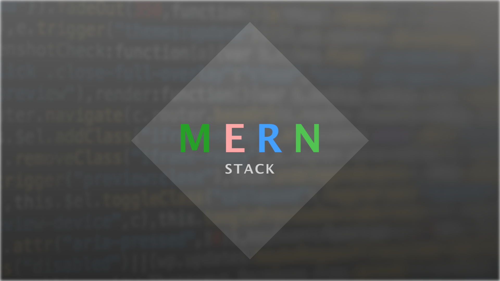

## Hi there 👋

I am [Rakib Hasan Babu](https://rhbabu.netlify.app/). Currently, I am learning Web Development and preparing myself as a MERN Stack Developer. I have already completed a few projects based on my little knowledge. You can take a look at my pinned repositories.

  
  

### Connect with me:

### Area of Exploring and Studying

#### Programming Languages

  
  
  
  

#### Frameworks and Libraries

  
  
  
  
  
  
  

#### Tool

  

#### Database

  

 
 

